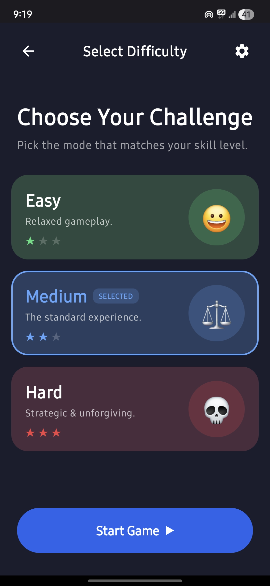
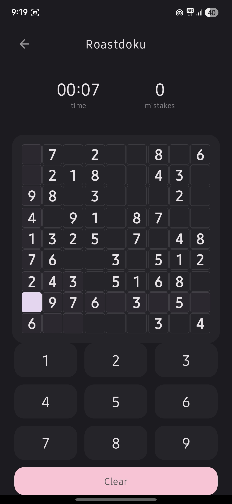
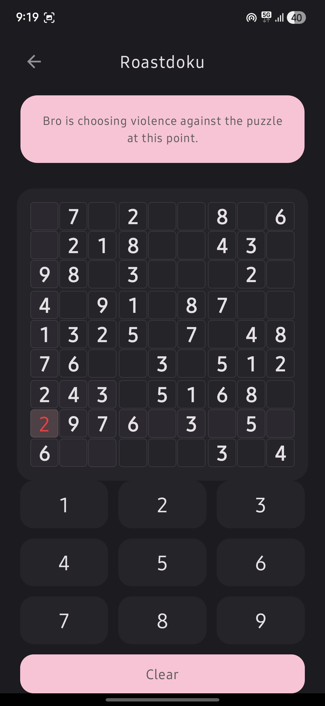

<div align="center">
  

  # Roastdoku
  ### The Sudoku That Roasts You 🔥

  [](https://www.gnu.org/licenses/gpl-3.0)
  [](https://github.com/AdhyanGupta948/Roastdoku/releases/latest)
  [](https://github.com/AdhyanGupta948/Roastdoku)
  [](https://kotlinlang.org)

</div>

---

Roastdoku is a modern, minimalist Sudoku game for Android with a unique twist — a built-in roast bot that playfully comments on your gameplay. Whether you make a wrong move, take too long, or pick Easy mode like a coward, the roast bot always has something to say.

## Screenshots

| Home Screen | Gameplay | Roast Bot |
|:-----------:|:--------:|:---------:|
|  |  |  |

## Features

- 🎯 **Three Difficulty Levels** — Easy, Medium, and Hard
- 🧩 **Intelligent Puzzle Generator** — A smart generator and solver for unique puzzles every time
- 🔥 **Dynamic Roast Engine** — The AI narrator reacts to your mistakes, slow pace, and difficulty choice with witty comments
- ⏱️ **Timer-Based Scoring** — Your score depends on how fast you can solve the puzzle
- 🎨 **Clean, Modern UI** — Minimalist design with smooth animations
- 📱 **Fully Responsive** — Works across a wide range of Android devices

## Download

<a href="https://github.com/AdhyanGupta948/Roastdoku/releases/latest">
  
</a>

> ⚠️ **Note:** Google Play Protect may flag this app because it is distributed outside the Play Store. It is completely safe — this is a free, open-source app with no tracking or ads. You can verify this by reviewing the source code.

## Building from Source

1. **Clone the repository**
   ```bash
   git clone https://github.com/AdhyanGupta948/Roastdoku.git
   ```

2. **Open in Android Studio** (Hedgehog or later)

3. **Set up `local.properties`** in the project root:
   ```
   sdk.dir=/path/to/your/android/sdk
   ```

4. **Sync Gradle** and build the project (`Build → Make Project`)

### Requirements

| Tool | Version |
|------|---------|
| Android Studio | Hedgehog+ |
| Kotlin | 1.9.20 |
| Min SDK | 24 (Android 7.0) |
| Target SDK | 34 (Android 14) |
| Gradle | 8.13 |

## What's New in v2.0.0

- Complete UI redesign with a new modern design language
- Improved core game logic for better stability
- Fixed multiple bugs and improved overall performance

See the full [Changelog](https://github.com/AdhyanGupta948/Roastdoku/releases) for previous versions.

## Contributing

Contributions are welcome! Feel free to open an issue or submit a pull request.

1. Fork the repository
2. Create your feature branch (`git checkout -b feature/your-feature`)
3. Commit your changes (`git commit -m 'Add some feature'`)
4. Push to the branch (`git push origin feature/your-feature`)
5. Open a Pull Request

## Privacy

Roastdoku does **not** collect any user data, use analytics, display ads, or require an internet connection. All game logic runs entirely on-device.

## License

This project is licensed under the **GNU General Public License v3.0**.
See the [LICENSE](LICENSE) file for full details.

---

<div align="center">
  Made with ❤️ by <strong>Adhyan Gupta</strong> · © 2025 Adhyan Gupta
</div>
